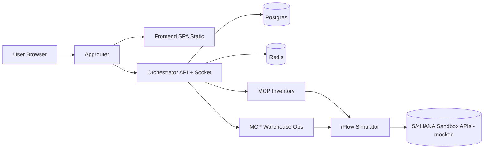

# Manufacturing Agent Monorepo

A full-stack, multi-service AI agentic application for SAP Manufacturing/Warehouse workflows.

## Assumptions

- This repo uses mock SAP Integration Suite and mock S/4 data because no real tenant credentials are available.
- `AUTH_MODE=mock` is for local development only. Production must use `AUTH_MODE=xsuaa`.
- MCP servers are exposed over HTTP and discovered from environment (`MCP_SERVERS`), not hardcoded.
- For local LLM usage, a self-hosted OpenAI-compatible endpoint (such as Ollama/vLLM) may be used.

## Monorepo Structure

- `shared`: Workspace package `@manufacturing-agent/shared` with shared types.
- `integration-mocks/iflow-simulator`: Integration Suite iFlow simulation service.
- `mcp-servers/mcp-inventory`: MCP read tools.
- `mcp-servers/mcp-warehouse-ops`: MCP write + movement tools.
- `orchestrator`: NestJS app for auth, agent loop, caching, quota, realtime, and admin APIs.
- `frontend`: React + TypeScript + Vite SPA with Tailwind + Recharts.
- `approuter`: SAP approuter production entrypoint.
- `infra`: DB schema, CF manifest, XSUAA security descriptor, docker compose.

## Architecture



### Runtime Contracts

- Single real-time channel: Socket.IO path `/ws`.
- Exact event names used end-to-end:
  - `chat:token`
  - `chat:done`
  - `chat:pending_action`
  - `session_log:new`
  - `token_usage:snapshot`
  - `token_usage:update`
- Standard error shape used by REST APIs:

```json
{ "error": { "code": "SCOPE_DENIED", "message": "human readable explanation" } }
```

## Build Order Implemented

1. Root workspace + shared package
2. Postgres schema + Docker Compose
3. iFlow simulator
4. MCP servers
5. Orchestrator
6. Frontend
7. Approuter
8. CF manifest + XSUAA descriptor
9. This README

## Local Development

### Prerequisites

- Node 20 (`.nvmrc` pinned)
- Docker / Docker Compose

### Option A: Full stack with Docker Compose

```bash
cd infra
docker compose up --build
```

Services and fixed ports:

- Postgres `5432`
- Redis `6379`
- iFlow simulator `4000`
- MCP inventory `4001`
- MCP warehouse ops `4002`
- Orchestrator `3000`
- Frontend `5173`
- Approuter `5000`

### Option B: Workspace dev script

```bash
npm install
npm run dev
```

This runs all workspaces with `concurrently`.

## Auth Flow

### Production (`AUTH_MODE=xsuaa`)

- Approuter is the public entry point.
- Approuter performs XSUAA OAuth2 authorization code login redirect.
- Approuter serves built frontend from its own `resources` folder.
- Approuter reverse-proxies `/api/**` and `/ws/**` to orchestrator with forwarded JWT.
- React app never talks directly to XSUAA.

### Local (`AUTH_MODE=mock`)

- Approuter can be skipped.
- Frontend uses `VITE_API_BASE_URL` and `VITE_WS_URL` to talk directly to orchestrator.
- Frontend mock login uses `/api/auth/mock-login` and sends returned bearer token.

## Data Model

DDL is in `infra/db/schema.sql` and includes exactly these tables:

- `users`
- `user_scopes`
- `user_quota`
- `token_usage`
- `conversations`
- `conversation_messages`
- `session_logs`

No parallel duplicate tables are used.

## Caching

- Generic read-tool key format:
  - `cache:{toolName}:{warehouseId|global}:{paramsHash}`
- `paramsHash` is SHA-256 of stable key-sorted JSON params.
- Default TTL: `CACHE_TTL_SECONDS=8640000` (100 days).
- Scope checks run before cache lookups.
- `getRecentMovements` is cache-native in `mcp-warehouse-ops` via `cache:movements:{warehouseId}` sorted set and `ZRANGEBYSCORE`.

## Agent + Confirmed Writes

- `POST /api/chat`: Runs tool-calling loop (max 8 rounds).
- Write tools are not executed immediately.
- Pending write actions are stored in Redis for 15 minutes and emitted as `chat:pending_action`.
- `POST /api/chat/confirm-action` executes write tool.
- Confirm action uses one-time consumption semantics (`GETDEL`) to prevent replay; consumed/expired action returns `410 ACTION_EXPIRED`.

## Token Metering and Quota

- Every LLM call writes a `token_usage` row.
- Quota check uses `SUM(total_tokens)` since `user_quota.period_start`.
- Over quota returns `429 QUOTA_EXCEEDED`.
- Daily scheduler rolls `period_start` monthly.
- On socket connect, orchestrator immediately emits `token_usage:snapshot`.

## LLM Providers

Configured via `LLM_PROVIDER`:

- `openai`
- `azure-openai`
- `anthropic`
- `self-hosted`

Self-hosted provider supports OpenAI-compatible endpoints and token estimation fallback (`tiktoken`) with `is_estimated=true` when usage is unavailable.

## iFlow Simulator and Real SAP Swap

Current mock app (`integration-mocks/iflow-simulator`) exposes:

- `GET /iflow/stock`
- `GET /iflow/materials/:materialId`
- `GET /iflow/movements`
- `POST /iflow/move`

Fixtures include:

- 5 warehouses
- 20+ materials with SAP-style IDs
- `P123` split across `packing` and `shipping` in warehouse `1010`
- Pre-seeded movements in last 24 hours

### Swap to real Integration Suite + S/4HANA

No MCP server code changes are required.

1. Deploy iFlows in Integration Suite to front real S/4HANA OData APIs.
2. Replace `IFLOW_BASE_URL`, `IFLOW_TOKEN_URL`, and OAuth credentials in MCP service bindings.
3. Keep MCP tool contracts unchanged.

Typical Integration Suite implementation:

1. Create an HTTPS sender endpoint per logical operation (`stock`, `movements`, `move`).
2. Use content modifier + request-reply steps to call S/4 OData endpoints.
3. Map payloads to stable MCP-facing JSON schemas.
4. Secure with OAuth2 client credentials or mTLS/certificate based auth per tenant policy.
5. Deploy iFlow and provide endpoint + client credentials to MCP services.

## Cloud Foundry Deployment

Descriptors:

- `infra/manifest.yml`
- `infra/xsuaa-security.json`

Apps:

- `manufacturing-approuter`
- `manufacturing-orchestrator`
- `manufacturing-mcp-inventory`
- `manufacturing-mcp-warehouse-ops`
- `manufacturing-iflow-simulator`

### Suggested zero-cost/free-tier services

- Managed Postgres free-tier where available, or user-provided external free-tier DB (Neon/Supabase).
- Managed Redis-compatible free-tier where available, or user-provided external free-tier (Upstash/Redis Cloud).

Do not run Postgres/Redis as CF buildpack apps because ephemeral filesystems invalidate audit and long-TTL cache requirements.

## Health Endpoints

All backend services expose:

- `GET /health` -> `200 { "status": "ok" }`

## Env Files

Each service contains `.env.example` with required variables and no committed secrets.

## Test Coverage Included

Vitest-based tests cover minimum required behaviors:

- Scope-check behavior including no-`warehouseId` case
- Cache hash stability and movement cache score-window logic
- Quota calculation behavior
- Confirm-action one-time consumption semantics
- iFlow simulator mutation + insufficient stock rejection
